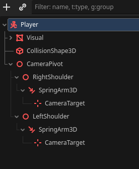
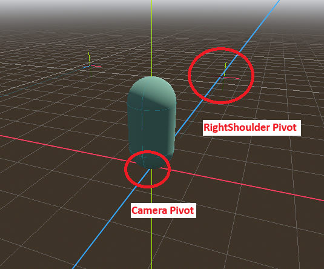

# cam-ots-test
Over The Shoulder Camera for Godot 4.5 utilizing PhantomCamera3D

## Problem Statement
This repo is created to solve the issue I have been dealing with:
https://forum.godotengine.org/t/over-the-shoulder-rotation-issues-with-thirdpersonfollow-phantomcamera3d/125379

## Control:
Right Click -> Right Shoulder \
Left Click -> Left Shoulder \
Middle Click -> ThirdPersonFollow \
Move -> WASD \
Jump -> Space \
Unlock Cursor -> Tab \
Quit -> Esc

## Solution
Basically the idea is to create a camera pivot at the character’s feet. Then create left/right shoulder pivot as a child of the camera pivot. As a child of that. create spring arm and a camera target in the Player Scene. In the main scene, create PhantomCamera3D simple follow and mimic lookat pointing at the camera target

On Mouse movement X, rotate CameraPivot on Y axis only (i.e: Yaw)
On Mouse movement Y, rotate ShoulderPivot on X axis only (i.e: Pitch)

CameraPivot should be TopLevel so that the Player rotation will not impact its rotation. However, CameraPivot position should follow Player’s position

I am using PhantomCamera3D Simple Follow and Mimic LookAt because the ThirdPerson follow interferes with the yaw and pitch of the shoulder. Potentially I can use the ThirdPerson follow by omitting the SpringArm I created under the shoulder pivot though, but that can be done for future exercise instead.

Here is the OverTheShoulder in action after the fix:

<video controls src="resources/solution.mp4" title="Title"></video>